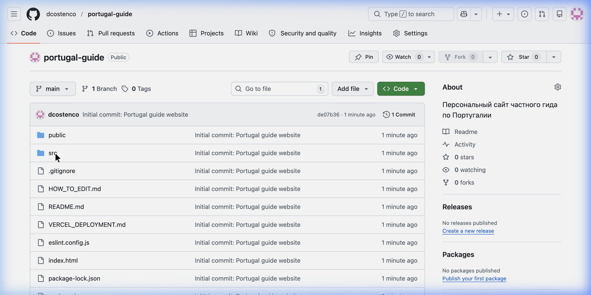
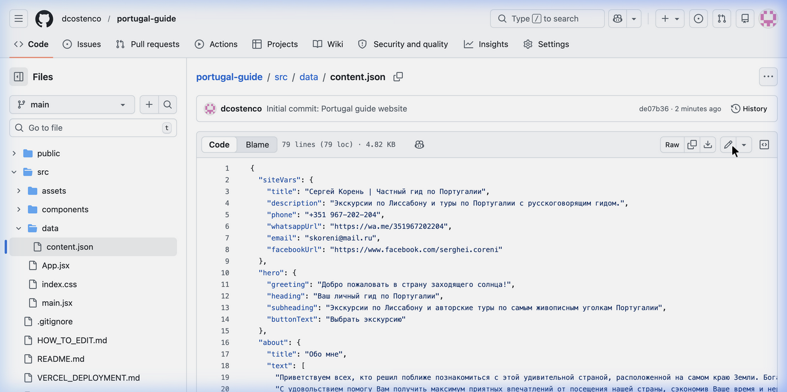

# 📖 ИНСТРУКЦИЯ ПО УПРАВЛЕНИЮ САЙТОМ

Сергей, добро пожаловать в инструкцию! Здесь нет ни одного сложного термина — только «нажмите сюда, напишите туда».

---

## 🎬 Видео-инструкция

Посмотрите видео с голосовой инструкцией на русском:

📹 [▶️ Скачать видео с озвучкой (MP4)](docs/tutorial/tutorial_with_sound.mp4) — нажмите «Download» справа, откройте и смотрите с звуком!

🔊 [▶️ Только аудио (MP3)](docs/tutorial/tutorial_audio_ru.mp3) — голосовая инструкция отдельно (1 минута)

---

## 🏠 Общая идея (30 секунд)

Весь ваш сайт управляется **одним файлом** — `content.json`.

В этом файле написан весь текст сайта: ваш телефон, название экскурсий, описания, отзывы.

**Меняете слово в файле → сайт обновляется автоматически через 2 минуты.**

Никаких программ устанавливать не нужно. Всё делается в браузере (Chrome, Safari и т.д.).

---

## 📋 Что вам нужно (один раз)

1. **Аккаунт на GitHub** — это бесплатный сайт, где хранится код вашего сайта.
   - Зарегистрируйтесь бесплатно на [github.com](https://github.com)
   - **Пришлите ваш логин** (имя пользователя) Дмитрию, чтобы он дал вам доступ к редактированию.

---

## 🔄 Как изменить текст на сайте (пошагово)

### Шаг 1: Откройте файл с контентом

Зайдите по этой ссылке (сохраните её в закладки!):

👉 **https://github.com/dcostenco/portugal-guide/blob/main/src/data/content.json** 👈

Вы увидите вот такую страницу:



---

### Шаг 2: Нажмите кнопку «Карандаш» ✏️

В правой верхней части файла найдите маленькую иконку **карандаша** и нажмите на неё.

Это откроет режим редактирования:



> ℹ️ Кнопка карандаша находится справа от кнопок «Raw», «Copy» и «Download».

---

### Шаг 3: Измените нужный текст

Откроется редактор. Файл выглядит так:

```json
{
  "siteVars": {
    "title": "Сергей Корень | Частный гид по Португалии",
    "phone": "+351 967-202-204",
    "whatsappUrl": "https://wa.me/351967202204",
    "email": "skoreni@mail.ru"
  }
}
```

> ⚠️ **Важные правила:**
> - Меняйте ТОЛЬКО текст **между кавычками** `"..."`
> - НЕ удаляйте кавычки `"`, запятые `,` и фигурные скобки `{}`
> - Если вы случайно что-то сломали — просто закройте страницу БЕЗ сохранения и начните заново

---

### Шаг 4: Сохраните изменения

1. Нажмите зелёную кнопку **«Commit changes...»** (в правом верхнем углу)
2. Появится маленькое окошко — нажмите зелёную кнопку **«Commit changes»** ещё раз
3. Готово!

⏱️ **Через 1-2 минуты** ваш сайт автоматически обновится!

---

## 📝 Примеры: Что именно можно менять

### 🔹 Изменить номер телефона

Найдите строку:
```
"phone": "+351 967-202-204",
```
Замените номер на новый:
```
"phone": "+351 123-456-789",
```

---

### 🔹 Изменить WhatsApp

Найдите строку:
```
"whatsappUrl": "https://wa.me/351967202204",
```
Замените номер (без пробелов и тире):
```
"whatsappUrl": "https://wa.me/351123456789",
```

---

### 🔹 Изменить описание экскурсии

Найдите нужный тур и измените текст в кавычках:
```
"description": "Ваш новый текст описания тура",
```

---

### 🔹 Добавить новый отзыв

Найдите раздел `"reviews"` и добавьте новый блок через запятую:

```json
{
  "name": "Имя туриста",
  "text": "Текст отзыва",
  "date": "Апрель 2026"
}
```

---

### 🔹 Добавить новую экскурсию

Найдите раздел `"tours"` и добавьте новый блок через запятую:

```json
{
  "id": "new-tour",
  "title": "Название экскурсии",
  "duration": "5 часов",
  "route": "Откуда → Куда",
  "description": "Описание экскурсии",
  "image": "/images/lisbon.jpeg"
}
```

---

## 🆘 Если что-то сломалось

1. **Не паникуйте!** Просто закройте страницу и начните заново
2. Или напишите Дмитрию — он восстановит за минуту

---

> 📌 **Резюме:** Откройте ссылку → Нажмите карандаш ✏️ → Измените текст в кавычках → Нажмите зелёную кнопку → Готово! Сайт обновится через 2 минуты.
