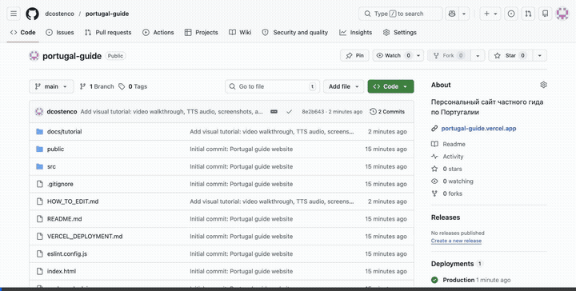

# 🇵🇹 Сергей Корень — Частный гид по Португалии

Персональный сайт частного гида по Лиссабону и Португалии.

🌐 **Сайт:** [portugal-guide.vercel.app](https://portugal-guide.vercel.app)

---

## 📚 Документация

| Документ | Описание |
|----------|----------|
| 📖 [**Инструкция по управлению сайтом**](HOW_TO_EDIT.md) | Пошаговая инструкция на русском: как менять тексты, туры, отзывы и контакты |
| 🎬 [**Видео-инструкция (MP4)**](docs/tutorial/tutorial_video.mp4) | 38-секундное видео с записью экрана — скачайте и посмотрите |
| 🔊 [**Аудио-инструкция (MP3)**](docs/tutorial/tutorial_audio_ru.mp3) | Голосовая инструкция на русском (1 минута) — скачайте и послушайте |
| 🚀 [**Инструкция по деплою на Vercel**](VERCEL_DEPLOYMENT.md) | Как разместить сайт в интернете бесплатно |

---

## ✏️ Быстрое редактирование

Чтобы изменить текст на сайте, откройте этот файл и нажмите карандаш ✏️:

👉 **[Редактировать контент сайта](src/data/content.json)** 👈

Подробная инструкция с картинками — в [HOW_TO_EDIT.md](HOW_TO_EDIT.md)

---

## 🎬 Как редактировать сайт (видео)

---

## 🏗️ Что можно менять

- 📞 **Телефон и WhatsApp** — номер, ссылка на мессенджер
- 📝 **Тексты** — приветствие, описание, «обо мне»
- 🗺️ **Экскурсии** — название, маршрут, длительность, описание
- ⭐ **Отзывы** — добавлять новые отзывы туристов
- 📧 **Email и соцсети** — адрес почты, ссылка на Facebook

---

## 🛠️ Технологии

- [React](https://react.dev/) + [Vite](https://vite.dev/)
- Vanilla CSS (Glassmorphism, параллакс)
- Хостинг: [Vercel](https://vercel.com/) (бесплатно)

---

## 🆘 Нужна помощь?

Если что-то не получается — напишите Дмитрию, он поможет!
